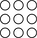

<!---
Copyright (c) 2021 - present / Neuralmagic, Inc. All Rights Reserved.

Licensed under the Apache License, Version 2.0 (the "License");
you may not use this file except in compliance with the License.
You may obtain a copy of the License at

    http://www.apache.org/licenses/LICENSE-2.0

Unless required by applicable law or agreed to in writing, software
distributed under the License is distributed on an "AS IS" BASIS,
WITHOUT WARRANTIES OR CONDITIONS OF ANY KIND, either express or implied.
See the License for the specific language governing permissions and
limitations under the License.
-->

#  SparseZoo

### Neural network model repository for highly sparse models and optimization recipes

<p>
    <a href="https://github.com/neuralmagic/comingsoon/blob/master/LICENSE">
        
    </a>
    <a href="https://docs.neuralmagic.com/sparsezoo/index.html">
        
    </a>
    <a href="https://github.com/neuralmagic/sparsezoo/releases">
        
    </a>
    <a href="https://github.com/neuralmagic.com/comingsoon/blob/master/CODE_OF_CONDUCT.md">
        
    </a>
     <a href="https://www.youtube.com/channel/UCo8dO_WMGYbWCRnj_Dxr4EA">
        
    </a>
     <a href="https://medium.com/limitlessai">
        
    </a>
    <a href="https://twitter.com/neuralmagic">
        
    </a>
 </p>

## Overview

SparseZoo is a constantly-growing repository of optimized models and optimization recipes for neural networks.
It simplifies and accelerates your time-to-value in building performant deep learning models with a 
collection of inference-optimized models and recipes to prototype from.

Available via API and hosted in the cloud, the SparseZoo contains both baseline and models optimized 
to different degrees of inference performance vs baseline loss recovery. 
Optimizations on neural networks include approaches such as 
[pruning](https://neuralmagic.com/blog/pruning-overview/) and [quantization](https://arxiv.org/abs/1609.07061)
allowing for significantly faster models with limited to no effect on their baseline metrics such as accuracy.
Recipe-driven approaches built around these optimizations allow you to take the models as given, 
transfer learn from the models onto private datasets, or transfer the recipes to your architectures. 

This repository contains the Python API code to handle the connection and authentication to the cloud.

## Quick Links

- [DeepSparse](https://github.com/neuralmagic/deepsparse): 
  CPU inference engine that delivers unprecedented performance for sparse models
- [SparseML](https://github.com/neuralmagic/sparseml): 
  Libraries for state-of-the-art deep neural network optimization algorithms, 
  enabling simple pipelines integration with a few lines of code
- [Sparsify](https://github.com/neuralmagic/sparsify): 
  Easy-to-use autoML interface to optimize deep neural networks for 
  better inference performance and a smaller footprint

## Quick Tour

Each model in the SparseZoo has a specific stub that identifies it. The stubs are made up of the following structure:

`DOMAIN/SUB_DOMAIN/ARCHITECTURE{-SUB_ARCHITECTURE}/FRAMEWORK/REPO/DATASET{-TRAINING_SCHEME}/OPTIM_NAME-OPTIM_CATEGORY-{OPTIM_TARGET}`

The properties within each model stub are defined as the following:

| Model Property   | Definition                                                                                    | Examples                                                                           |
|:----------------:|:---------------------------------------------------------------------------------------------:|:-----------------------------------------------------------------------------------:|
| DOMAIN           | The type of solution the model is architected and trained for                                 | cv, nlp                                                                             |
| SUB_DOMAIN       | The sub type of solution the model is architected and trained for                             | classification, segmentation                                                         |
| ARCHITECTURE     | The name of the guiding setup for the network's graph                                         | resnet_v1, mobilenet_v1                                                             |
| SUB_ARCHITECTURE | (optional) The scaled version of the architecture such as width, depth, etc                   | 50, 101, 152                                                                         |
| FRAMEWORK        | The machine learning framework the model was defined and trained in                           | pytorch, tensorflow_v1                                                               |
| REPO             | The model repository the model and baseline weights originated from                           | sparseml, torchvision                                                               |
| DATASET          | The dataset the model was trained on                                                          | imagenet, cifar10                                                                   |
| TRAINING_SCHEME  | (optional) A description on how the model was trained                                         | augmented, lower_lr                                                                 |
| OPTIM_NAME       | An overview of what was done to optimize the model                                            | base, pruned, quant (quantized), pruned_quant, arch (architecture modified)          |
| OPTIM_CATEGORY   | Descriptor on the degree to which the model is optimized as compared with the baseline metric | none, conservative (100% baseline), moderate (>= 99% baseline), aggressive (< 99%) |
| OPTIM_TARGET     | (optional) Descriptor for the target environment the model was optimized for                  | disk, edge, deepsparse, gpu                                                         |

### Python APIS

The Python APIs respect this format enabling you to search and download models.
Some code examples are given below.

#### Searching the Zoo
```python
from sparsezoo import Zoo

models = Zoo.search_models(domain="cv", sub_domain="classification")
print(models)
```

#### Common Models
```python
from sparsezoo.models.classification import resnet_50

model = resnet_50()
model.download()

print(model.onnx_file.downloaded_path())
```

#### Searching Optimized Versions
```python
from sparsezoo import Zoo
from sparsezoo.models.classification import resnet_50

search_model = resnet_50()
optimized_models = Zoo.search_optimized_models(search_model)

print(optimized_models)
```

### Console Scripts

In addition to the Python APIs, a console script entry point is installed with the package `sparsezoo`.
This enables easy interaction straight from your console/terminal.
Note, for some environments the console scripts cannot install properly.
If this happens for your system and the sparsezoo command is not available, 
`scripts/sparsezoo.py` may be used in its place. 

```shell script
sparsezoo -h
```

#### Searching

Search command help
```shell script
sparsezoo search -h
```

<br>Searching for all classification models in the computer vision domain
```shell script
sparsezoo search --domain cv --sub-domain classification \
    --architecture resnet_v1 --sub-architecture 50
```

<br>Searching for all ResNet 50 models
```shell script
sparsezoo search --domain cv --sub-domain classification
```

#### Downloading

Download command help
```shell script
sparsezoo download -h
```

<br>Download ResNet 50 Model
```shell script
sparsezoo download --domain cv --sub-domain classification \
    --architecture resnet_v1 --sub-architecture 50 \
    --framework pytorch --repo sparseml --dataset imagenet \
    --optim-name base --optim-category none
```

<br>Download pruned and quantized ResNet 50 Model
```shell script
sparsezoo download --domain cv --sub-domain classification \
    --architecture resnet_v1 --sub-architecture 50 \
    --framework pytorch --repo sparseml \
    --dataset imagenet --training-scheme augmented \
    --optim-name pruned_quant --optim-category aggressive
```

For a more in-depth read, check out [SparseZoo documentation](https://docs.neuralmagic.com/sparsezoo/).

### Installation

This repository is tested on Python 3.6+, and Linux/Debian systems.
It is recommended to install in a [virtual environment](https://docs.python.org/3/library/venv.html) 
to keep your system in order.

Install with pip using:

```bash
pip install sparsezoo
```

Then if you would like to explore any of the [scripts](scripts/), [notebooks](notebooks/), or [examples](examples/)
clone the repository and install any additional dependencies as required.

## Available Models and Recipes

A number of pre-trained baseline and optimized models across domains and sub domains are available and constantly being added.
For an up to date list, please consult the [available models listing](https://docs.neuralmagic.com/sparsezoo/available-models).

## Resources and Learning More

- [SparseZoo Documentation](https://docs.neuralmagic.com/sparsezoo/)
- [SparseML Documentation](https://docs.neuralmagic.com/sparseml/)
- [Sparsify Documentation](https://docs.neuralmagic.com/sparsify/)
- [DeepSparse Documentation](https://docs.neuralmagic.com/deepsparse/)
- Neural Magic [Blog](https://www.neuralmagic.com/blog/), 
  [Resources](https://www.neuralmagic.com/resources/), 
  [Website](https://www.neuralmagic.com/)

## Contributing

We appreciate contributions to the code, examples, and documentation as well as bug reports and feature requests! 
[Learn how here](CONTRIBUTING.md).

## Join the Community

For user help or questions about SparseZoo, 
use our [GitHub Discussions](https://www.github.com/neuralmagic/sparsezoo/discussions/). Everyone is welcome!

You can get the latest news, webinar and event invites, research papers, 
and other ML Performance tidbits by [subscribing](https://neuralmagic.com/subscribe/) to the Neural Magic community.

For more general questions about Neural Magic, 
please email us at [learnmore@neuralmagic.com](mailto:learnmore@neuralmagic.com) 
or fill out this [form](http://neuralmagic.com/contact/).

## License

The project is licensed under the [Apache License Version 2.0](LICENSE).

## Release History

Official builds are hosted on PyPi
- stable: [sparsezoo](https://pypi.org/project/sparsezoo/)
- nightly (dev): [sparsezoo-nightly](https://pypi.org/project/sparsezoo-nightly/)

Additionally, more information can be found via [GitHub Releases.](https://github.com/neuralmagic/sparsezoo/releases)
